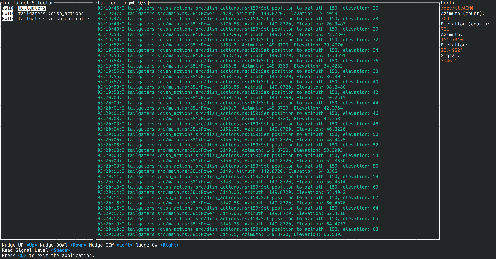
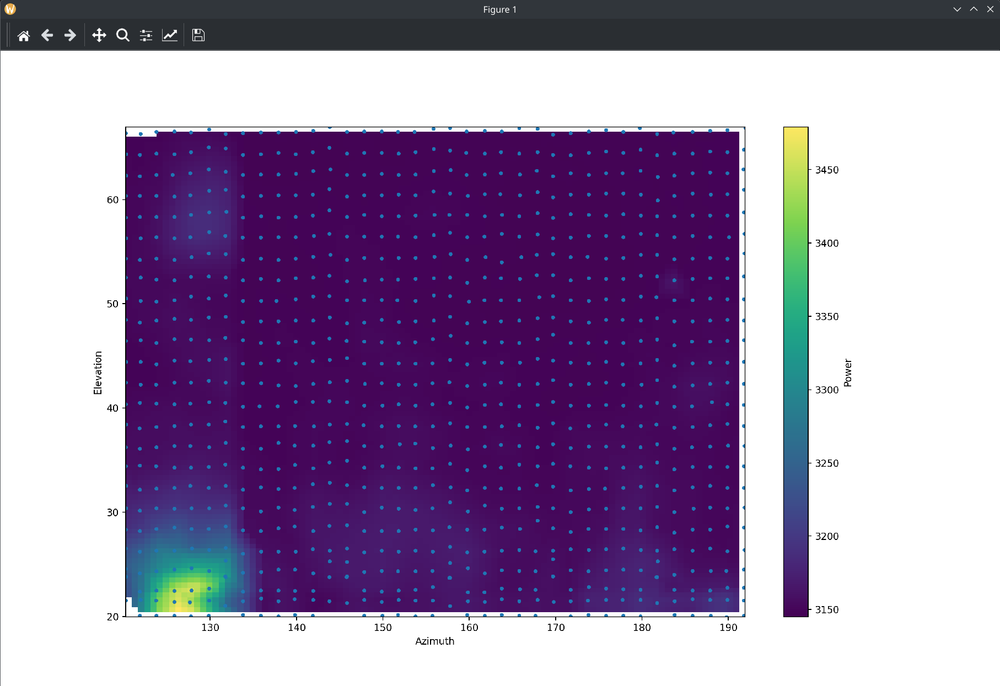

# Tailgaters

Rust implementation for a driver and scanning software for the Tailgater satellite dish.

All the documentation for prepping the hardware is in the original project by [saveitforparts](https://github.com/saveitforparts/Tailgater-Microwave-Imaging)




## Build and run

### Interactive mode
```bash
cargo run
```

You can then use the on-screen instructions to control the dish and take measurements

### Scan mode

There is a built-in scan mode that will scan the dish in a specified range of azimuth and elevation angles, taking measurements at each point. The scan will be saved in a .csv file.

```bash
cargo run -- --scan --az-start 120 --az-end 220 --el-start 20 --el-end 70 --step 2.5
```

You can read and plot the scan data using the `plot.py` script 

```bash
python plot.py rf_power_1741745129.csv
```

The python script watches the file for changes and updates the plot in real-time as the scan progresses.



(example plot of an indoor scan)
